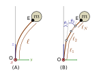

Consider the flexible rod depicted in (A):

{#fig:flexible-rod width=60%}

We discretize it into $N$ segments, as shown in (B), with $\ell_i$ the length of segment $i$ and $\theta_i$ the angle it makes with its parent segment (or the vertical for $\theta_1$).

Our goal is to compute the position $p_E := {}_W p_{OE}$ of the end-effector $E$ with respect to the rod origin $O$ in the inertial frame $W$.

1. Attach a frame to each link, and write down the transform $T_{i, i+1}$ from link $i+1$ to its parent link $i$.
2. Calculate the transform $T_{W, N}$ from the last link $N$ to the inertial frame $W$, and then $p_E$.

Let's consider the case where all segments have the same length $\ell_i = \frac{\ell}{N}$ and the rod has uniform curvature, so that all relative orientations $\theta_i$ are equal to $\frac{\Theta}{N}$.

3. Calculate in closed form the expression of $p_E$ when the number of segments $N \to \infty$.
4. What value of $\Theta$ maximizes the distance between $E$ and $O$?
