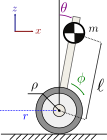

Consider the wheeled inverted pendulum decpited in the following figure:

{#fig:wheeled-inverted-pendulum width=60%}

Its equation of motion is:

$$
\ell \ddot{\theta} = g \sin(\theta) - \ddot{r} \cos(\theta)
$$

The system starts with an initial angle $\theta_{\mathrm{i}}$ with its wheel immobile ($\ddot{r} = 0$) with respect to an inertial frame attached to the ground. The wheel motor is commanded in acceleration $u = \ddot{\phi}$.

1. The wheel motor has a maximum acceleration constraint $\ddot{\phi} \leq a_{\mathrm{max}}$. What is the maximum initial angle $\theta_{\mathrm{i,max}}(a_{\mathrm{max}})$ from which the robot can balance?
    - You can admit a standard result from control theory that, among 
